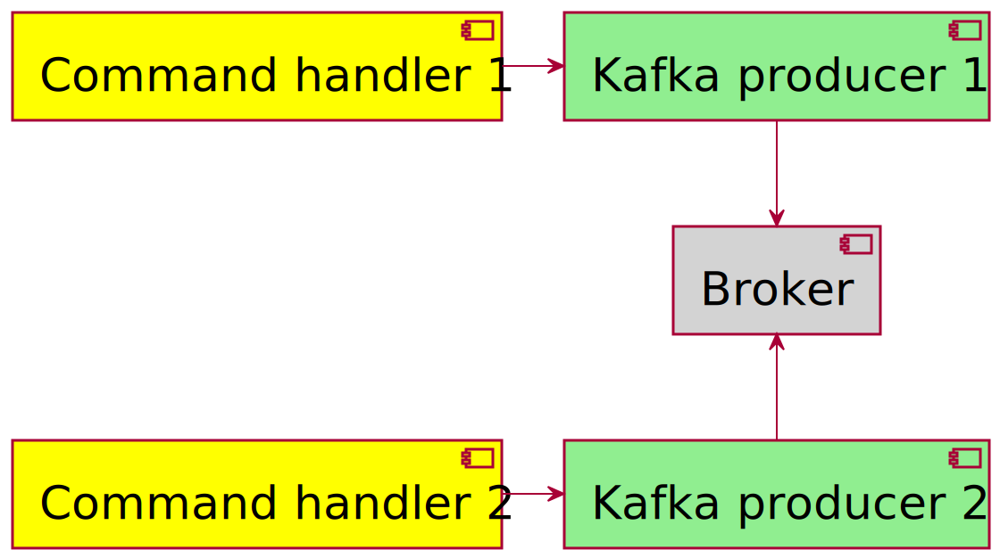
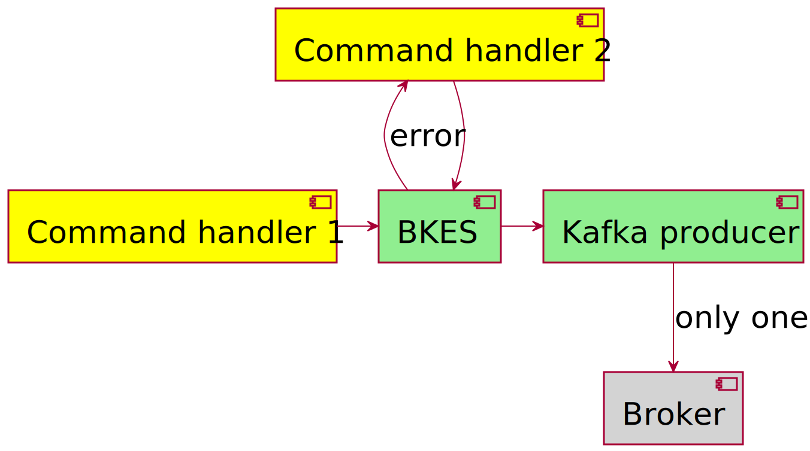
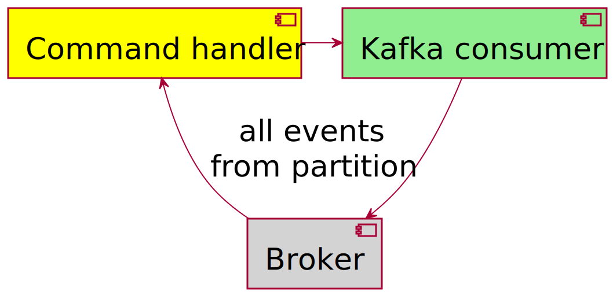
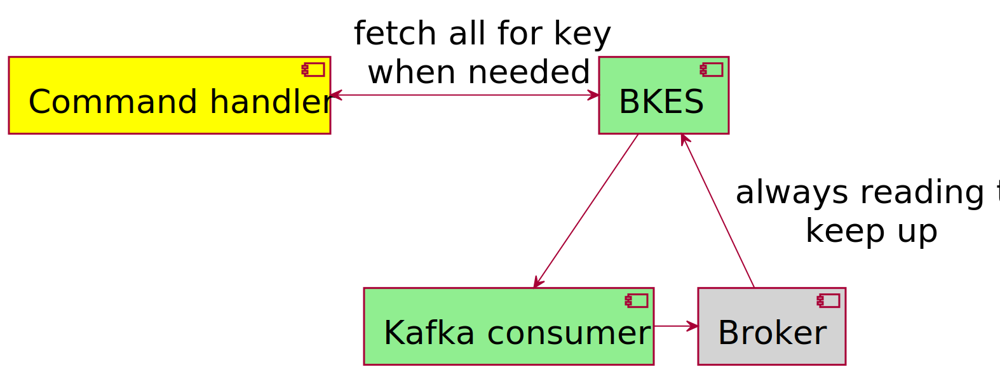

# Binary Kafka backed Event Store

This is currently a POC status project and should not be used in production. Giving it a try and providing feedback on
GitHub Discussions is very much appreciated. The main goal is to have a fast, low memory event store backed by a Kafka topic. A demo project using bkes can be found at [bkes-demo](https://github.com/gklijs/bkes-demo). 

## Advantages

BKES is solving two problems when implementing an event sourcing architecture based on Kafka, specific for the command
handlers. Those two problems are concurrent writes, and restoring an aggregate.

### Concurrent writes

Kafka is in essence a append only log, where 'everything goes'. Meaning it will just care about some binary information,
and add it to the log, without being able to do some validation. In case we have two command handlers, we would prefer
some way of preventing concurrent writes. This might lead to inconsistent states, where for example two persons would
have rented the same book at the same time.

By routing the creating of the events through bkes this can be prevented. For this to work properly, it's important all
calls with the same key, go to the same bkes instance.

### Restoring an aggregate

With Kafka, it's not possible to filter messages when consuming them. It's possible to ignore some of them, but if you
want to make sure you get all the events with a certain key, at the very least you will need to read the whole partition
the key 'belongs' to from start.

Because with bkes all the events witht he same key are stored separately it's trivial to at any moment get all the
messages for a key. Because of this a command handler could wait till a command for a certain aggregate comes along, and
only then restore it.

## Design principles

The core principle is that Kafka should be the source of truth, so on startup it synchronizes with Kafka. This means it
will read all the messages from the last known offset in the db, or from the start, and makes sure the db will contain
exactly the binaries present on the Kafka topic.

For now, it's assumed most one `bkes` instance is available for one topic at a time, to prevent concurrent writes of the
same topic and order. A nicer future solution would route traffic to the 'leader' of a specific partition, or based on
the hash of the key route the traffic. For now things are kept simple. A second instance might be started, as long as
the api can't be called, to create a new restore point.

Another principle is to stay as close as possible to the Kafka Api for it to work. This means it doesn't expect any
specific headers or such, and can be used with an existing Kafka topic. Also, by sticking to binaries being able to read
those bytes in a useful way is not part of the responsibility of `bkes`. For it to accept a new event, the only check
that's done is making sure the order is the same the caller of the api expects.

Records are added to the db with offset and partition at -1. As soon as the record is read, the correct values for the
offset and partition will be set from the record, when retrieving records you might want to ignore those.

## Development

The docker compose file is using a builder, so you don't need anything besides docker to run it.

Use `docker exec kafka kafka-topics --create --topic bkes --bootstrap-server localhost:9092 --partitions 5 --replication-factor 1`
to create a topic to start.

The `defaults.sh` script can be used as `source defaults.sh` to easily set the needed env variables when developing.